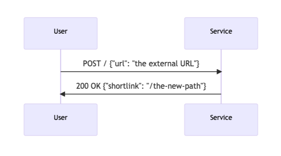
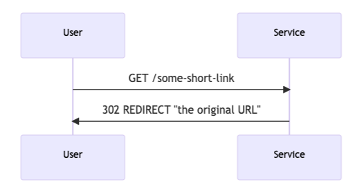
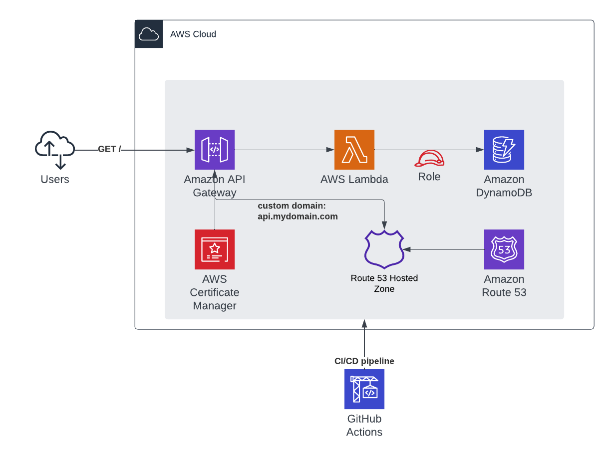

# Battlefy URL Shortener API

[](https://github.com/progerjkd/battlefy-assessment/actions/workflows/pipeline.yml)

This is a serverless URL shortener API built using AWS Lambda, API Gateway and DynamoDB.
The API was built using FastAPI and Python, and it has only two endpoints as shown below:

One HTTP action to register new URLs, and returns the random shorten URL: 

<p align="center">
  
</p>

And another endpoint to resolve a given shortlink:

<p align="center">
  
</p>

# Architecture
<p align="center">
  
</p>

**Amazon** API Gateway is an AWS service for creating and securing REST APIs at any scale.

**AWS Lambda** is a serverless, event-driven compute service that allows one to run code without provisioning or managing servers.

**DynamoDB** is a fully managed NoSQL database service that provides fast and predictable performance with seamless scalability.

## Folder structure

The folder structure was created by a blank CDK project created with ```cdk init```.

```resources/layers/python``` - directory where the CI/CD pipeline will use to build the lambda layer containing the project dependencies.

```resources/shortener_app``` - main directory containing the application code

```resources/shortener_app/schemas.py``` - Using the pydantic library, we model the expected request and validate urls formatting

```resources/shortener_app/requirements.txt``` - library dependencies used by the app


# Objective 2: The Deployment

A GitHub Actions pipeline is defined in the file ```.github/workflows/pipeline.yml```.
We need to setup the following secrets and variables on GitHub to be injected in the pipeline:
- AWS_ACCESS_KEY_ID - AWS access key
- AWS_SECRET_ACCESS_KEY - AWS secret access key
- CUSTOM_DOMAIN - custom domain to be used by API Gateway

In order to deploy a custom domain name for our API in API Gateway, it was needed to create a few extra resources:
- The CDK stack needs to receive an pre-existing Route 53 Hosted Zone -- via GitHub Actions environment variable CUSTOM_DOMAIN
- A new ACM Certificate will be generated pointing to domain "api.CUSTOM_DOMAIN"
- A new Route53 record 'api' will be added to the CUSTOM_DOMAIN hosted zone


# Objective 3: The Operations

Without changing the functionality of the service, how to:

## Guarantee handling of traffic bursts with over 9000 parallel requests?
 - For Lambda, we could raise a quota increase greater than the default 1000 request per all lambdas in one AWS Account.
 - We could add Provisioned concurrency to the Lambda function, thus it would scale without fluctuations in latency.
 - Adoption of SQS Queues betwen API Gateway and the Lambda Function. Optionally leverage StepFunctions to create serverless workflows with dead-letter queues.
 - Setup edge-optimized API Gateway endpoints with a built-in CloudFront distribution to deliver content quickluy to global clients.
 - Adoption of a cache service like Elasticache/Redis in order to cache responses for a given URL.
 - DynamoDB Accelerator could help by adding in-memory acceleration to the DynamoDB table.
 

## Minimize monthly cloud provider costs as much as possible?
 - Set up Lambda function timeout
 - Set CloudWatch billing alarms to be alarmed for unexpected bursts


## protect the POST action so that only our administrators can submit URLs?
 - We could use a Lambda function for authorization in API Gateway, which would validade a JWT token to allow access to protected APIs.
 - We could use a Cognito user pool with the admin users and grant access to protected resources in API Gateway.
 - We could use IAM authentication for the protected resources.

Optimize your repository to accommodate for these operational goals.
